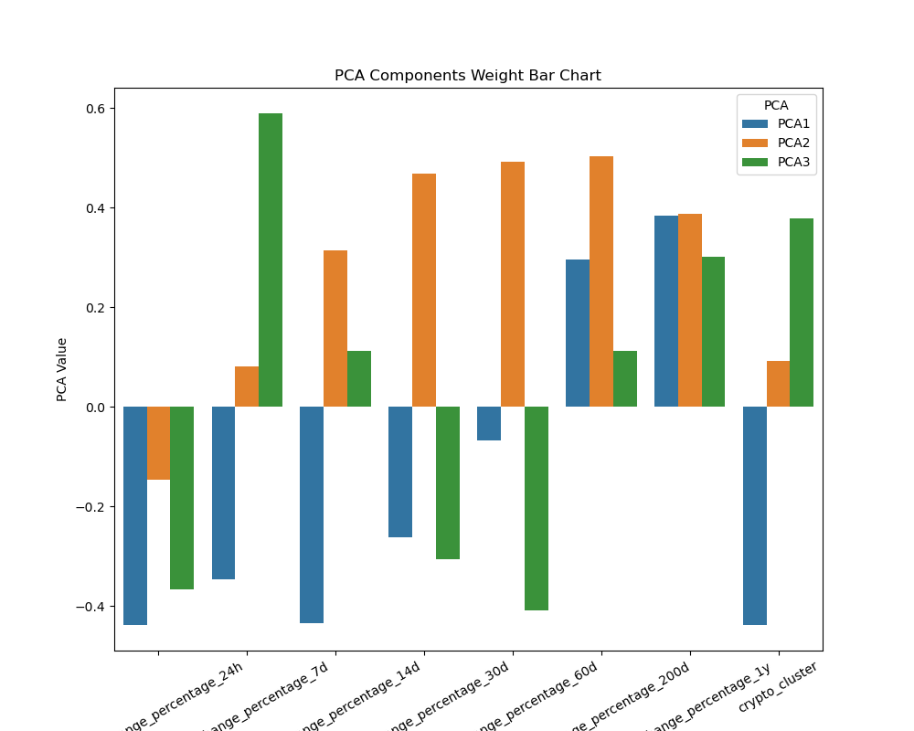

# CryptoClustering

Module 11 Challenge

#### Prepare the Data

  

1. Use the `StandardScaler()` module from `scikit-learn` to normalize the data from the CSV file.

2. Create a DataFrame with the scaled data and set the "coin_id" index from the original DataFrame as the index for the new DataFrame.

- The first five rows of the scaled DataFrame should appear as follows:

  

#### Find the Best Value for k Using the Original Scaled DataFrame

  

Use the elbow method to find the best value for `k` by completing the following steps:

  

1. Create a list with the number of k values from 1 to 11.

2. Create an empty list to store the inertia values.

3. Create a `for` loop to compute the inertia with each possible value of `k`.

4. Create a dictionary with the data to plot the elbow curve.

5. Plot a line chart with all the inertia values computed with the different values of `k` to visually identify the optimal value for `k`.

6. Answer the following question in your notebook: What is the best value for `k`?

#### Answer the following question:

**Question:** What is the best value for `k`?

**Answer:** 5 is the best value as the trend flattening out at that inertia

  

#### Cluster Cryptocurrencies with K-Means Using the Original Scaled Data

  

Use the following steps to cluster the cryptocurrencies for the best value for `k` on the original scaled data:

  

1. Initialize the K-means model with the best value for `k`.

2. Create an instance of K-means, define the number of clusters based on the best value of `k`, and then fit the model using the original scaled DataFrame.

3. Predict the clusters to group the cryptocurrencies using the original scaled DataFrame.

4. Create a copy of the original data and add a new column with the predicted clusters.

5. Create a scatterplot using pandas’ `plot` as follows:

- Set the x-axis as "price_change_percentage_24h" and the y-axis as "price_change_percentage_7d".

  
  

#### Optimize Clusters with Principal Component Analysis

  

1. Using the original scaled DataFrame, perform a PCA and reduce the features to three principal components.

2. Retrieve the explained variance to determine how much information can be attributed to each principal component and then answer the following question in your notebook:

	**array([0.3719856 , 0.34700813, 0.17603793])**

#### Answer the following question:
 
**Question:** What is the total explained variance of the three principal components?
  
**Answer:** **0.8788327449101367**

- What is the total explained variance of the three principal components?

3. Create a new DataFrame with the PCA data and set the "coin_id" index from the original DataFrame as the index for the new DataFrame.

- The first five rows of the PCA DataFrame should appear as follows:

  

#### Find the Best Value for k Using the PCA Data

  

Use the elbow method on the PCA data to find the best value for `k` using the following steps:

  

1. Create a list with the number of k-values from 1 to 11.

2. Create an empty list to store the inertia values.

3. Create a `for` loop to compute the inertia with each possible value of `k`.

4. Create a dictionary with the data to plot the elbow curve.

5. Plot a line chart with all the inertia values computed with the different values of `k` to visually identify the optimal value for `k`.

6. Answer the following questions in your notebook:

- What is the best value for `k` when using the PCA data?

- Does it differ from the best k-value found using the original data?

  
 
 #### Answer the following questions:

*  **Question:** What is the best value for `k` when using the PCA data?
  
*  **Answer:** PCA data method best K_value K=4
 
 *  **Question:** Does it differ from the best k value found using the original data?
  
*  **Answer:** Yes, reduced by one dimensional the k values to visualize with one less cluster K=4 instead K=5 original K-mean value 

#### Cluster Cryptocurrencies with K-Means Using the PCA Data

  

Use the following steps to cluster the cryptocurrencies for the best value for `k` on the PCA data:

  

1. Initialize the K-means model with the best value for `k`.

2. Create an instance of K-means, define the number of clusters based on the best value of `k`, and then fit the model using the PCA data.

3. Predict the clusters to group the cryptocurrencies using the PCA data.

4. Create a copy of the DataFrame with the PCA data and add a new column to store the predicted clusters.

5. Create a scatter plot using pandas’ `plot` as follows:

- Set the x-axis as "PC1" and the y-axis as "PC2".

 

- Set the x-axis as "PC2" and the y-axis as "PC3".

6. Answer the following question:

- What is the impact of using fewer features to cluster the data using K-Means?

- Answer: Simplify the data by reducing the number of features to better representation for the data set when there are too many features. 

PCA Bar Chart Plot all features
 

#### Determine the Weights of Each Feature on Each Principal Component

  

1. Create a DataFrame that shows the weights of each feature (column) for each principal component by using the columns from the original scaled DataFrame as the index.

2. Which features have the strongest positive or negative influence on each component?

  
#### Answer the following question: 

* **Question:** Which features have the strongest positive or negative influence on each component? 
 
* **Answer:**
* *  **PCA1**:
    
    -   Indicates a positive trend up to 60 days, after which the future trend decreases.
    -   Crypto_cluster indicated the lower or negative values. 
      
*   **PCA2**:
    
    -   The higher values for PCA2 futures from all the coin_ids show 200 days and one year.
    -   Short-term futures (14 days) start with negative values but turn positive after 30 days.

*  **PCA3**:
    
    -   Compared to PCA1, PCA2 has higher values for the future of 30 days.
    -   Maintains these values slightly up to 60 days, after which the long-term futures decrease started from the futures of 200 days.
 
**Note** : short term up to 60 days.
long term 200 days and 1 year.
